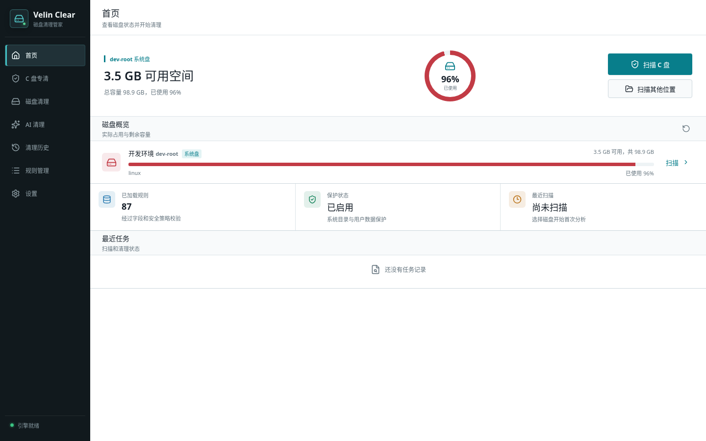

# Velin Clear

Windows 磁盘清理工具，专注于可解释、可复核的空间回收。



Velin Clear 采用 Go + Wails + React 构建，提供接近原生桌面软件的亮色/暗色界面。它会扫描真实文件系统，先展示路径、用途、占用大小、清理影响和风险，再由用户确认永久删除。应用数据、SQLite 数据库和清理历史均保存在程序目录下的 `data/`，不会写入外部用户目录。

## 功能

- **C 盘专清和其他磁盘**：按卷查看占用，支持快速、标准、深度扫描。
- **大文件检索模块**：独立按大小检索指定目录或磁盘中的大文件，默认不勾选，支持文件夹聚合和逐项确认。
- **145 条内置规则**：覆盖 Windows 系统、浏览器、国内常用软件、开发工具、游戏平台、影音和云盘；规则区分系统级、第三方和通用分析。
- **可解释结果**：每条结果说明当前文件用途、清理后影响、建议程度、风险等级和默认选中状态。
- **文件夹视图**：结果按文件夹折叠展示，勾选文件夹会联动选择其下可清理文件，分析项和禁止项始终排除。
- **大文件和下载目录分析**：列出大文件、安装包、压缩包和下载候选，默认不选，逐项确认后处理。
- **大目录与重复文件分析**：按目录累计占用定位空间来源，按内容哈希识别重复文件，均默认仅分析。
- **扫描排除和白名单**：可在设置中排除项目、网盘和个人资料目录，排除项不会进入扫描结果。
- **Windows 专项分析**：回收站、更新下载、Prefetch、分页文件、休眠文件、还原点等特殊项目提供说明和系统设置入口，不直接误删。
- **AI Cleaning Agent**：配置 OpenAI-compatible `base_url`、模型和密钥后，AI 只分析磁盘清理问题，返回受限的文件候选和清理建议，不能扩大扫描范围或执行删除。
- **规则同步**：从仓库 HTTPS 地址同步经过字段、路径和安全校验的最新规则。
- **应用更新**：在设置页检查 GitHub Release，下载后校验 SHA-256，再由用户确认重启安装；更新包和临时脚本只保存在程序目录 `data/updates/`。
- **启动更新检测**：应用启动后在后台静默检查最新 Release，发现新版本时在设置入口提示；网络异常不会阻塞使用，也不会自动下载或安装。
- **HTTP 代理**：设置页可配置 `http://host:port` 代理，规则同步、更新检查/下载和 AI Provider 请求统一使用，留空即直连。
- **清理历史**：记录扫描和永久删除结果，便于复核。

## 安全边界

Velin Clear 的清理动作只有永久删除和清空回收站两类，执行前会重新校验路径、文件状态和用户选择。高风险目录（聊天附件、云盘任务、剪辑草稿、邮件数据库等）只做分析，默认不选，并提供软件官方处理建议。规则不接受任意 Shell 命令，也不会把整个 `AppData` 当成缓存目录。

## 下载

从 [Releases](https://github.com/ttyob/velin-disk-clear/releases) 下载最新 Windows x64 版本。开发分支中的新增规则会在下一次版本发布时随 EXE 一起更新。

## 开发环境

- Go 1.25+
- Node.js 22+
- Windows WebView2 Runtime（运行桌面程序）

Linux/macOS 可运行后端测试和浏览器预览；Windows API、DPAPI、回收站和系统设置入口需要在 Windows 上验证。

```bash
go test -race ./...
go vet ./...
cd frontend && npm ci && npm run build
```

## 浏览器预览

浏览器预览同样调用 Go API、真实 SQLite 和扫描引擎：

```bash
# 终端 1：监听所有网卡的 Go API
go run . --dev-api --dev-api-addr 0.0.0.0:8788

# 终端 2：启动 Vite
cd frontend && npm ci && npm run dev -- --host 0.0.0.0
```

打开 `http://127.0.0.1:5173`。从局域网访问时使用运行主机 IP；Vite 会将 `/api` 请求代理到 Go 的 `:8788` 端口。

## 构建 Windows EXE

```bash
go run github.com/wailsapp/wails/v2/cmd/wails@v2.15.0 build -platform windows/amd64
```

产物位于 `build/bin/Velin Clear.exe`。推送 `v*` 标签会触发 `.github/workflows/release.yml`，由 GitHub Actions 自动构建并发布 Release。

## 规则维护

规则文件位于 [`internal/rules/builtin/`](internal/rules/builtin/)，每条规则必须包含用途、清理影响、推荐程度、风险、默认选中状态、扫描根路径和安全根路径。新增或修改规则后运行：

```bash
go test ./internal/rules
```

完整规则说明见 [docs/builtin-rules.md](docs/builtin-rules.md)。产品需求文档是本地开发资料，不随仓库发布。

## 许可证

项目当前未指定开源许可证。商用或再分发前请先联系项目维护者。
